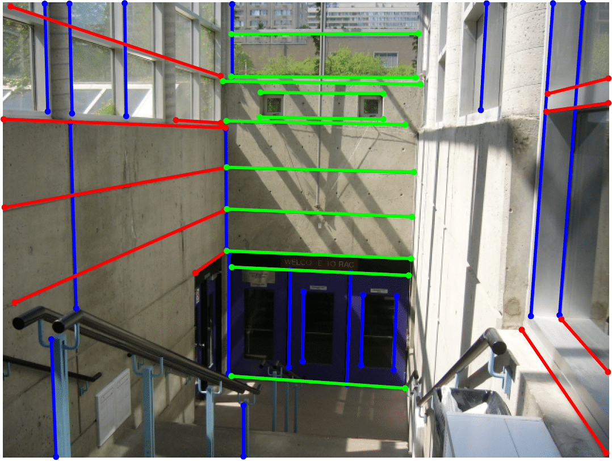
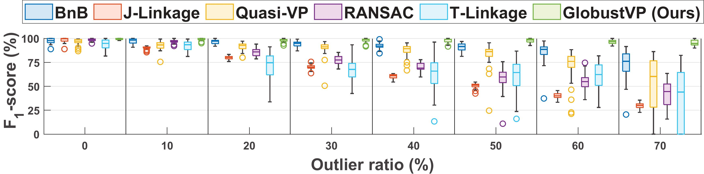

<p align="center">
  <h1 align="center"> <ins>GlobustVP</ins> 💥<br>Convex Relaxation for Robust Vanishing Point Estimation in Manhattan World</h1>
  <h3 align="center">CVPR 2025 Award Candidate & Oral</h3>
  <p align="center">
    <span class="author-block">
      <a href="https://bangyan101.github.io/">Bangyan Liao</a><sup>*</sup>
      ·
      <a href="https://ericzzj1989.github.io/">Zhenjun Zhao</a><sup>*</sup>
      ·
      <a href="https://sites.google.com/view/haoangli/homepage">Haoang Li</a>
      ·
      <a href="https://sites.google.com/view/zhouyi-joey/home">Yi Zhou</a>
      ·
      <a href="">Yingping Zeng</a>
      ·
      <a href="">Hao Li</a>
      ·
      <a href="https://ethliup.github.io/">Peidong Liu</a><sup>†</sup>
  </p>
  <p align="center">
    <sup>*</sup> equal contribution, <sup>†</sup> corresponding author
  </p>
  <div align="center">

  [](https://arxiv.org/abs/2505.04788)
  [](LICENSE)
  [](https://colab.research.google.com/github/WU-CVGL/GlobustVP/blob/main/demo.ipynb)

  </div>
</p>

Official implementation of the CVPR 2025 Award Candidate & Oral paper:
**"Convex Relaxation for Robust Vanishing Point Estimation in Manhattan World"**

<p align="center">
  <a href="https://arxiv.org/abs/2505.04788">
    
  </a>
  <br>
  <em>A globally optimal and outlier-robust method for vanishing point (VP) estimation in Manhattan world using convex relaxation.</em>
</p>

## 🔍 Overview

**GlobustVP** is a globally optimal and outlier-robust method for vanishing point (VP) estimation under the Manhattan World assumption. It introduces **convex relaxation** into VP estimation by formulating the problem as a quadratically constrained quadratic program (QCQP) and relaxing it into a convex semidefinite program (SDP). This avoids local minima and scales to realistic noise and outlier settings.

## ✨ Highlights

- **Global optimality** without initialization
- **Robust** up to 70% outliers
- **Efficient** runtime (~50ms/image)
- **State-of-the-art** performance on YUD and SU3 datasets
- **No training** or deep models required

## 📦 Installation and Demo [](https://colab.research.google.com/github/WU-CVGL/GlobustVP/blob/main/demo.ipynb)

**Dependencies**:
- Python ≥ 3.8
- `numpy`, `matplotlib`, `scipy`, `opencv-python`
- `cvxpy` with an SDP solver: [SCS](https://github.com/cvxgrp/scs) or [MOSEK](https://www.mosek.com/)

Install this repo and run the demo on a real image using [LSD](https://dev.ipol.im/~qbammey/anne/LSD_A_Fast_Line_Segment_Detector_with_a_False_Detection_Control.pdf) and [SCS](https://github.com/cvxgrp/scs):

```bash
git clone https://github.com/ericzzj1989/GlobustVP.git && cd GlobustVP
python -m pip install -e .
```

Then open [demo.ipynb](demo.ipynb) locally, or try it online via using Google Colab.

## 🚀 Getting Started (Synthetic Evaluation)

### 1. Prepare config file

Create a JSON configuration file (e.g., default file `config/param.json`):

```json
{
  "line_num": 120,
  "iteration": 100,
  "outlier_ratio": [0.0, 0.1, 0.2, 0.3, 0.4, 0.5],
  "sample_line_num": 6,
  "vanishing_point_num": 3,
  "endpoint_noise": 1.0,
  "line_length": 4.0,
  "gt_vp_noise": 0.001,
  "c": 0.03,
  "K": [[800, 0, 320], [0, 800, 240], [0, 0, 1]]
}
```

### 2. Run experiment

```bash
python -m globustvp.run_experiments --config globustvp/config/param.json
```

### 3. View results

- Results saved in `results/experiment_results.json`
- Figures saved in `figures/`
- Boxplots of precision, recall, and F1-score are automatically generated

## 🧪 Try GlobustVP on Your Image

A minimal notebook demo is available in [demo.ipynb](demo.ipynb), showing how to detect line segments and estimate vanishing points using GlobustVP.

### Example code snippet

```python
import numpy as np

from globustvp.solver.core import globustvp
from globustvp.utils.io import load_image_and_gray
from globustvp.utils.geometry import (
    normalize_lines,
    compute_backprojection_normals,
    compute_line_uncertainties
)
from globustvp.utils.plot import plot_lines_on_image, visualize_line_vp_associations
from globustvp.utils.line_processing import detect_and_format_lines

# Step 1: Load input image
img, gray = load_image_and_gray("path/demo.jpg")

# Step 2: Detect 2D lines using LSD
lines_2D = detect_and_format_lines(gray_image=gray, min_length=30)

# Step 3: Normalize lines
K = np.array([[674.917975164175, 0, 307.551305282635],
              [0, 674.917975164175, 251.454244960136],
              [0, 0, 1]])

normalized_lines = normalize_lines(K, lines_2D).T

# Step 4: Back-project lines to plane normals
para_lines = compute_backprojection_normals(normalized_lines)

# Step 5: Assign uncertainty
uncertainty = compute_line_uncertainties(normalized_lines, K, use_uncertainty=True)

# Step 6: Run GlobustVP
param = {
    "line_num": lines_2D.shape[1],
    "vanishing_point_num": 3,
    "c": 0.03,
    "sample_line_num": 4,
    "is_fast_solver": True,
    "eigen_threshold": 1,
    "solver": "SCS" # or MOSEK
}
status, est_vps, est_corrs = globustvp(normalized_lines, para_lines, uncertainty, param)
```

## 🗃️ Code Structure

```graphql
├── solver/
│   ├── core.py                     # GlobustVP solver
│   ├── sdp_solver.py               # SDP formulation and optimizer
│   └── solver_utils.py             # Solver utilities (sampling, checks, recovery)
├── utils/
│   ├── data.py                     # Synthetic data generation
│   ├── experiment.py               # Run single experiment
│   ├── geometry.py                 # Normalization and projection
│   ├── io.py                       # Config parsing and result saving
│   ├── line_processing.py          # LSD detection and line filtering
│   ├── metrics.py                  # Evaluation metrics
│   └── plot.py                     # Visualization
├── run_experiments.py              # Main script for synthetic experiments
└── demo.ipynb                      # Notebook demo on custom images
```

## 📊 Results

### Synthetic data (F1-score vs. Outlier ratio)


### Real-world results (YUD)
| Method       | AA@3° | AA@5° | AA@10° |
|--------------|-------|-------|--------|
| J-Linkage [44] | 57.7 | 69.3  | 80.5 |
| Quasi-VP [31] | 57.8 | 72.5 | 84.3 |
| NeurVPS [51] | 52.2 | 64.2  | 78.1   |
| GlobustVP 🏆 | **67.6** | **87.3** | **96.1** |

## 📁 Datasets

- [YUD (York Urban Database)](https://www.elderlab.yorku.ca/resources/york-urban-line-segment-database-information/)
- [SU3 (SceneCity Urban 3D Wireframe Dataset)](https://github.com/zhou13/shapeunity)
- [NYU-VP](https://github.com/fkluger/nyu_vp)

## 📝 Citation

If you use this code or paper, please consider citing:

```bibtex
@inproceedings{liao2025globustvp,
  title={Convex Relaxation for Robust Vanishing Point Estimation in Manhattan World},
  author={Liao, Bangyan and Zhao, Zhenjun and Li, Haoang and Zhou, Yi and Zeng, Yingping and Li, Hao and Liu, Peidong},
  booktitle={Proceedings of the IEEE/CVF Conference on Computer Vision and Pattern Recognition (CVPR)},
  year={2025}
}
```

## 📬 Contact

For questions or feedback, feel free to contact:

- [Bangyan Liao](mailto:liaobangyan@westlake.edu.cn) 
- [Zhenjun Zhao](mailto:ericzzj89@gmail.com)